Traffic from malicious bots can lead to negative user experiences, financial losses, and operational bottlenecks ranging from add-to-cart attacks that disrupt your web applications to distributed denial of service (DDoS) attacks that increase your infrastructure costs. In this workshop, explore how AWS uses a combination of techniques to identify and mitigate different types of bots and fraudulent activities. Gain valuable insights into how AWS WAF and Amazon CloudFront work together to safeguard and deliver your applications. You must bring your laptop to participate.
Devansh Agrawal, Sr Cloud Support Engineer, Amazon

Paul Kelsey, Sr Solutions Architect, Amazon Web Services

Wed, December 4
3:30 PM - 5:30 PM PST
Mandalay Bay | Level 2 South | Oceanside A
Session types: Workshop
Topic: Security, Compliance & Identity, Content Delivery
Industry : Cross-Industry Solutions
Area of interest: Application Security
Level: 300 – Advanced
Role: Cloud Security Specialist, Developer / Engineer
Services: Amazon CloudFront, AWS WAF

# Notes

## Different types of attacks
* Denial of Service
* App vulnerabilities (XSS, SQL Injection, CVE, etc)
* Goot bots (search engines etc..)
* Bad bots (Account fraud, account takeover, fake signup)

## Common Incidents

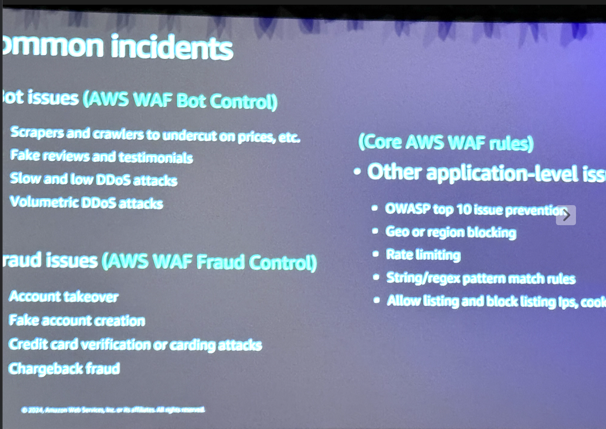

## Common Architecture


## AWS Managed Rules: Three Types


## AWS WAF Typical Workflow


## What is account takeover prevention (ATP)?

Detect and mitigate against login attempts made by unauthorized users
* sign-in page
* managed rule group
* sdk/API

## Account creation fraud prevention (ACFP)

* Protects application sign-up and registration pages

# Workshop
https://join.workshops.aws
 
Event access code 9467-016c39-23

Demo application URL - 
https://d3pdf4xb6xc0sb.cloudfront.net

## Welcome

This workshop will take you through the tools and methodologies available for managing account fraud, such as Account Takeover and Account Creation Fraud, hitting your web application or service.

What is account fraud?
User accounts are one of the most prized possessions for bad actors. Attempted brute force attacks, credential stuffing attacks, and abusing compromised credentials are all attacks that might steal user data or create fraudulent transactions on your application, commonly referred to as Account takeover attacks.
Account creation fraud is a set of attacks set out to create accounts on your application, with malicious intent to use a stolen or a fake identity, as well as for creating fraudulent activities meant for monetization, through your web application.

Who is this workshop for?
The content in this workshop is relevant for people running web applications or services, managing CDN (Content Delivery Network) configurations, WAF (web application firewalls) or fraud controls. It does require a baseline level of technical knowledge and familiarity with AWS services, such as described in the prerequisites below.

In this workshop you will:

Learn how to build controls for account fraud activities, focusing around your login and sign-up processes.
Learn how to create and configure AWS WAF, with a focus on the AWS managed rule groups for Fraud Control Prevention.
Learn how to configure and query AWS WAF logs using Amazon CloudWatch Logs Insights.

This workshop was developed for AWS-run events and as of today it doesn't have a self-paced option.
Overall, the entire exercise should take around 90-120 minutes to complete.

Prerequisites
This workshop is at an advanced level (300-Level) and assumes you know your way around the AWS Management Console, as well as the following prerequisites:

Amazon CloudFront basic concepts and configurations
AWS WAF concepts
Basic understanding of HTTP/S
A device to log in to the AWS Management Console and follow the instructions of the workshop
You do NOT need to know or write code in CloudFormation, or any other programming languages for this workshop. You WILL use the AWS console to configure AWS WAF rules and run queries in Amazon CloudWatch Logs Insights.

Know before you go
The event operator provided an access link to the AWS Workshop Studio event engine, this gives you access to a sandboxed account.
The AWS account provided will only be available for the duration of this workshop and you will not be able to retain access after the workshop is complete. Backup any materials you wish to keep access to after the workshop.
Any pre-provisioned infrastructure will be deployed to a specific region, in this session it is N. Virginia (us-east-1).
The AWS console link at the bottom of the Workshop Studio navigation bar will open the AWS Management Console home page. This is the standard AWS Console that provides access to each service.
Before you start
Review the terms and conditions of the event. Do not upload any personal or confidential information in the account.

## Architecture of Unicorn Rentals
You are the proud owner of Unicorn Rentals and have experienced immense growth in the past year, to celebrate you'll be holding a special sale with limited edition items, especially for members. You want to make sure your Unicorns go to real, loyal buyers and not malicious actors. To achieve this, you'll need to build and test an AWS WAF WebACL with the controls you need.

Below is the basic architecture of your Unicorn Rentals application, this is already running in the workshop account provided.

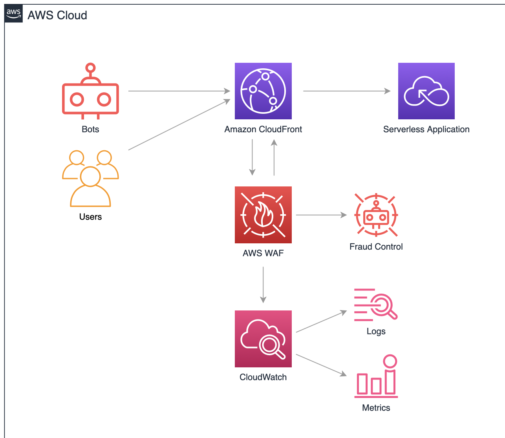

## Dev Tools and viewing header information
Type a@example.com for the email, and password for the password (don't press Enter just yet).

There is no such account on the website, you are just using it to inspect web traffic. The site is programed to respond with a Success! message to any POST request.
Clear your Network activity of old requests, by clicking this button Clear Network Activity, this is for Google Chrome, and click Login on the login page.
The Network tab should show requests for /login-submit.html. You might need to scroll up or down to see them. Click the line in which they appear, to inspect the request body.
The Headers tab shows us that we got a 200 Ok response from the application, we can see it was a POST request, and the request URI was login-submit.html
Clicking on the Payload tab shows us exactly what you sent from the browser. The username field is called username, and the password field is called password. This is all we need to set up Account Takeover Prevention on AWS WAF. You can now close the developer tools on your browser.

## Configuring Account Takeover Prevention

1. Go to your workshop web ACL Rules tab, and add a new managed rule.
2. Under AWS managed rule groups, Paid rule groups, click the button to Add to web ACL next to the Account takeover prevention managed rule.
3. Click Edit.
4. Scope of inspection: Inspect all web requests
5. Go to the Rule group configuration section, and use the following configuration parameters:
Login path: /login-submit.html
Payload type: FORM_ENCODED
Username field: username
Password field: password
Select Status code as the Component Type to be inspected in the response from the web application
Set 200 as the Success code
Set 401 as the Failure code

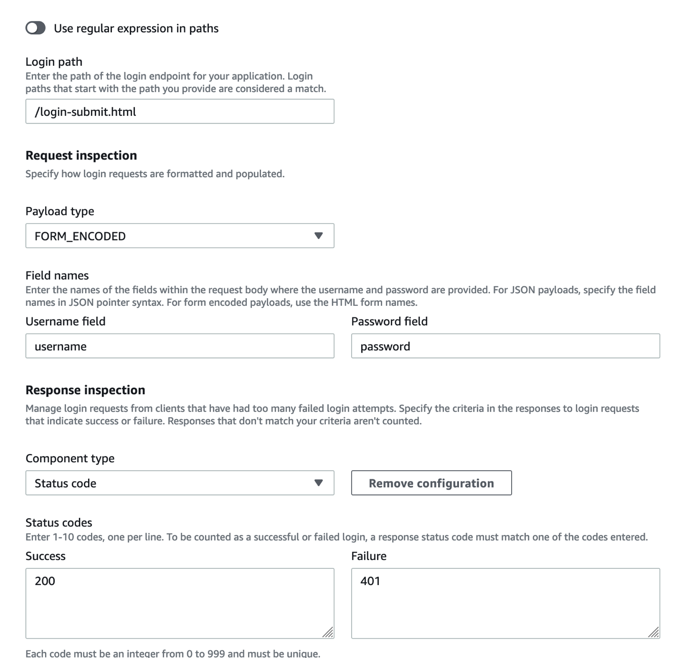

## Create a custom response body

Go to the web acl rule, then navigate to custom response body and select create a custom response object

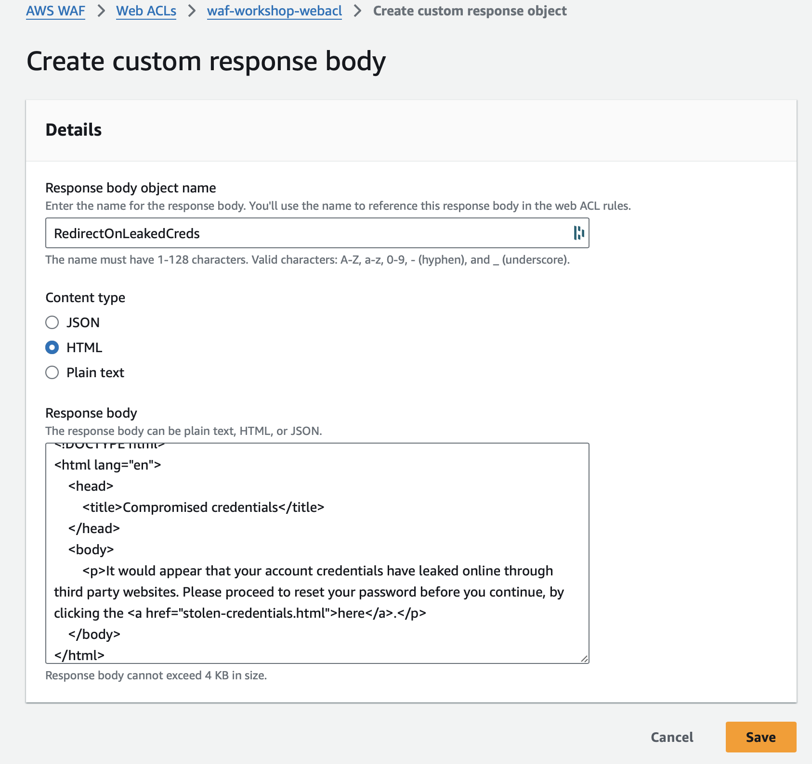

## Create a Custom Password Reset Rule

1. On your workshop's web ACL Rules tab, create a new custom rule by choosing Add rules, click on Add my own rules and rule groups and name it RedirectToResetPassword.
2. Match the statement Has a label, and use the awswaf:managed:aws:atp:signal:credential_compromised label as the Match key.

3. Each rule evaluation by a managed rule will add a label to identify a match, on a non-terminating rule. For more details on which labels are included in the rule group check DescribedManagedRuleGroup API 
4. Select the Block action, and click Custom response.
5. Click Enable, and type in 401 as the response code. This could be any response code, but 401 typically indicates that the user failed to login.
6. Click the Choose how you would like to specify the response body drop-down, and choose the custom response body you created previously, named RedirectOnLeakedCreds.
7. Click Add rule, and move the newly created rule down so that it is right after the AWS-AWSManagedRulesATPRuleSet managed rule group. Then, click Save.
8. Wait a minute until configuration changes propagate, and try to login with the test credentials again.
Email: WAF_TEST_CREDENTIAL@wafexample.com
Password: WAF_TEST_CREDENTIAL_PASSWORD
Check the logs on the CloudWatch Logs Insights  tab
fields @timestamp, httpRequest.clientIp, action, terminatingRuleId
| parse @message '"labels":[*]' as Labels
| filter httpRequest.uri = "/login-submit.html"
| sort @timestamp desc

Did you get the custom error message?. Check the results of the query, you should see the compromised credentials label listed. What is the terminatingRuleId?

## AWS WAF SDK
1. AWS WAF provides active controls that allow you to challenge incoming requests through either a JavaScript that a browser needs to run, or a CAPTCHA challenge, that a human needs to solve. Additionally, once a client is successfully challenged, AWS WAF attaches a Unique Browser Identifier - or UBID (in the form of a cookie) - that allows it to track session behavior beyond a single request.

2. This capability is very useful in detecting elusive actors that try to hide behind a proxy fleet and continuously change their IP address. For example looking at ATP's sub-rules, within the managed rule group you can see the following:

3. Looking at VolumetricIPHigh or VolumetricIpFailedLoginResponseHigh - these rules within the ATP rule-group are set to detect and block IP addresses that create more than a few failed attempts to login, or more than 20 login attempts, successful or not. Those rules are operating at the IP level and require no session tracking. However, looking some of the other sub-rules in ATP, they track session anomalies, and so, in order to work they require a UBID to track.

4. There is a number of options to integrate the UBID token into your application:

5. Integrate the AWS WAF SDK into your application (JavaScript, Android, and iOS are available)
Create a challenge rule action in any WAF rule
Create a CAPTCHA rule action in any WAF rule.
The recommended way is implementing the SDK into the web (or mobile) application itself, as you will in the next exercise.

## Integrate AWS WAF SDK with your web application

1. On the AWS WAF console, navigate to the Application integration SDKs.
2. Make sure you are on the Global (CloudFront) region.
3. Select our web ACL from the Web ACLs that are enabled for application list.
4. Click the JavaScript SDK drop down, and observe the integration script. Keep it handy for the next few steps.

```js
<script type="text/javascript" src="https://bc1c2c3c0e43.edge.sdk.awswaf.com/bc1c2c3c0e43/e94e1430c2f1/challenge.js" defer></script>
```

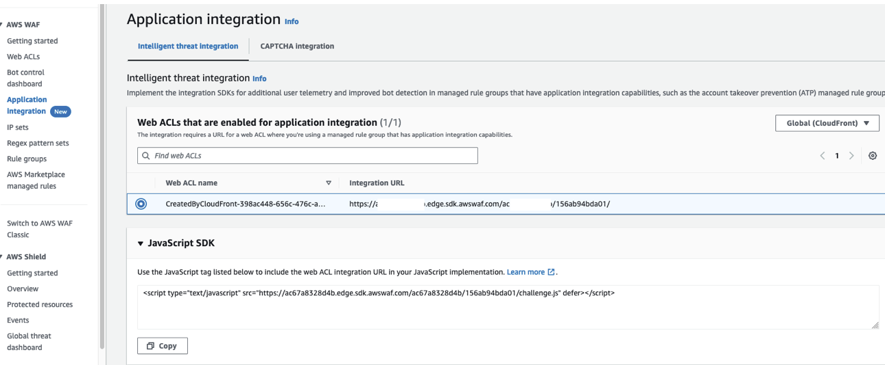

5. Navigate to the S3 service console , on the AWS Management Console (Open it in a new tab, and keep the AWS WAF tab open).
6. Locate the bucket with workshop-cfn-fraudworkshopbucket in its name. Click into it.
7. Within the bucket, location the object called index.html, and download it to your device.
8. Edit the file with your favorite text editing software, and copy the SDK integration script from step 4 into the head part of the HTML page (right below the line that says title is a good place). Save the file under the same name.
9. Upload the index.html file back into the bucket (you can just drag and drop it into the S3 console in you browser, and click Upload).
10. You can now test the new index.html by navigating to your demo application from a new browser tab. You can also open the browser developer tools (typically by hitting F12) and try to see the challenge get invoked. (Hint: look for requests to go to challenge.js, and later to a verify endpoint).

## Testing ATP Rules

1. You will attempt to get locked out of the application's login page, and inspect the logs. Attempt 10-20 login attempts in rapid succession. You can send the same curl request you did before.

``` bash
curl -v -X POST \
     -d 'username=WAF_TEST_CREDENTIAL@wafexample.com&password=WAF_TEST_CREDENTIAL_PASSWORD' \
     https://d3pdf4xb6xc0sb.cloudfront.net/login-submit.html
```

## Show Logs in cloudwatch

```
fields @timestamp, httpRequest.clientIp, action, terminatingRuleId
| parse @message '"labels":[*]' as Labels
| filter httpRequest.uri = "/login-submit.html"
| sort @timestamp desc
```

See the labels token absent and captcha absent

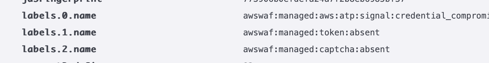
    
### Run this command from cloudshell

``` bash
URL="https://d3pdf4xb6xc0sb.cloudfront.net/login-submit.html"
for i in $(seq 1 20); do curl --http1.1 -X POST -H "Content-Type: application/x-www-form-urlencoded" -d 'username=WAF_TEST_CREDENTIAL@wafexample.com&password=WAF_TEST_CREDENTIAL_PASSWORD' -w "Status code: %{response_code}\n" ${URL} -s -o /dev/null; done
```

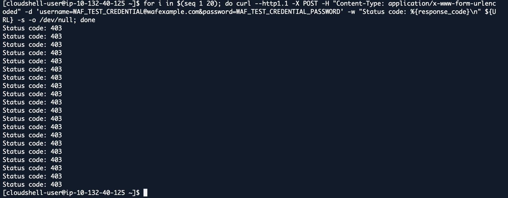

# Setting up account creation fraud prevention (ACFP)
Now that you have controls in place for existing users to login during the special sale, you also need to guarantee that any new users that come into our site to enjoy the sale are real, legitimate users.

In this chapter, you will explore the protection options available with AWS WAF Account Creation Fraud Prevention (ACFP), mitigating and stopping attempts at creating fake accounts through our web application sign-up page. It's common that fraud by fake accounts happens on accounts that were created 24 hours or less before the fraudulent transaction attempt, so blocking fake accounts from ever being created is key in blocking subsequent fraud attempts.

## Adding account creation fraud prevention to your web ACL

### Examine the sign-up process in your application
1. Open your browser's developer tools (View>>Developer>>Developer Tools for Google Chrome).
2. Navigate to the workshop website in your browser, and click the link that says Click here to create an account.
ACFP Config 1
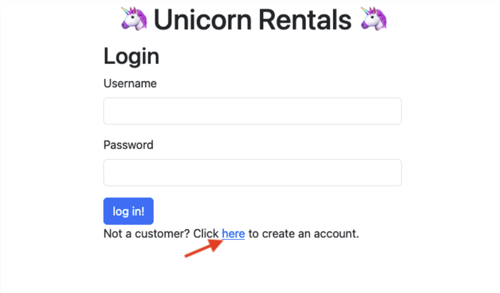

3. Inspect the Network tab on your developer tools pane/window, and look for the registration page's URI. (should be create-account.html)
4. Fill out the sign-up page with any information, and click Register.
5. Check for the form submission URI, as well as the payload that was sent. (should be a POST request to create--account-submit-html)
6. Keep the developer tools pane open, as you will refer to it on the next exercise.

### Adding the managed-rule to your web ACL
1. On your workshop web ACL, add a new rule (under the Rules tab, click Add rules, Add managed rules groups).
2. Enable the Account creation fraud prevention - new managed rule, and click Edit to configure your sign-up page details.
3. To configure the ACFP managed rule group you will need:
4. The registration page path: This is the URI that shows the account creation form
5. The account creation path: This is the URI that the browser will send the POST request to. (Captured in the Developer Tools/Inspect source)
6. The payload format and the name of the fields. (Captured in the Developer Tools/Inspect source)

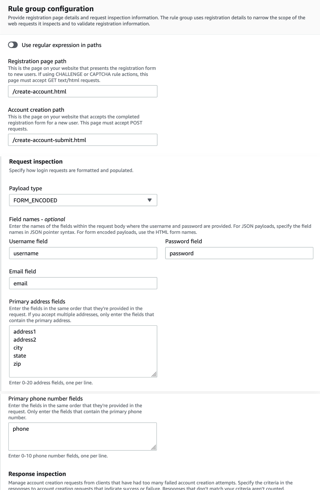

7. Scroll to the bottom of the page and click Save rule
8. Scroll again to the bottom of the page and click Add rules
9. Once on the Set rule priority screen you can scroll down and click Save

## Testing newly created rules

1. Navigate to the Register link on your demo application.
2. Find the AWS WAF token stored in your browser using Developer Tools. In Google Chrome, it will be under the Application tab, and Cookies. In Firefox, it would be in the Storage tab.
3. Locate the cookie named aws-waf-token, and press backspace or delete to delete it. If you do not see it, navigate to your demo application root page, and you should see it then.

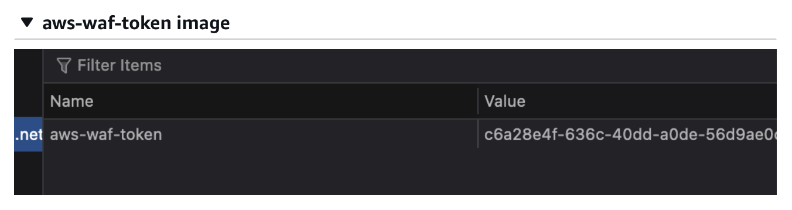

1. Make sure you see the developer tools Network tab.
Fill in test details into the page, and click Register.
2. View the Network tab activity, to see that your session is being validated with a token.
3. What did you observe?

4. Inspect the logs
5. On the AWS WAF console, in your web ACL details window, navigate to Cloudwatch Logs Insights.
```
fields @timestamp, action
| parse @message '"labels":[*]' as Labels
| filter httpRequest.uri = "/create-account-submit.html"
| sort @timestamp desc
| limit 20
```

[!captcha test after registration](image14.png)

6. Take a look at the log entries, what are the actions present in the log entries? Are there any entries in nonTerminatingRules list?

### Registering for a new account through the CLI
1. Run this curl command, don't forget to change the cloudfront URL:
```bash
curl -v -X POST \
    -H "Content-Type: application/json" \
    -d 'username=user&email=user@example.com&password=password&confirm_password=password&address1=5000 Webacl Ave.&address2=Apartment 19C&city=New Wafshire&state=WA&zip=98170&phone=1111111111' \
    https://d3pdf4xb6xc0sb.cloudfront.net/create-account-submit.html
```

2. Follow the respone on your CLI screen. Can you recognize being challenged?

3. Attempt to re-run the same curl command 30 more times. You should be getting the exact same result.

```bash
for i in $(seq 1 30); do curl -s -o /dev/null \
    -w "Status code: %{response_code}\n" \
    -X POST \
    -H "Content-Type: application/json" \
    -d 'username=user&email=user@example.com&password=password&confirm_password=password&address1=5000 Webacl Ave.&address2=Apartment 19C&city=New Wafshire&state=WA&zip=98170&phone=1111111111' \
    https://d3pdf4xb6xc0sb.cloudfront.net/create-account-submit.html; sleep 0.5; done
```

### Increasing the interactive challenge level
Moving the rule to serve a more interactive CAPTCHA challenge, can work as way to force the submitter through an additional hurdle, that for bot operators could mean time and expensive resources.

1. On your web ACL rules tab, check to box next to the AWS-AWSManagedRulesACFPRuleSet rule, and click Edit.
2. Navigate down to the Account creation fraud prevention rules section, and locate the AllRequests rule. Note that it is currently set to Challenge.
3. Change the override for this rule to Override to CAPTCHA.
4. Click Save rule, and Save.
5. Wait for 30 seconds for the configuration to propagate to CloudFront.
6. Navigate back to your web application registration page, and try to register again. A CAPTCHA appears after trying to register. If using the CLI you should see a request to solve the CAPTCHA challenge.
7. Wait for a minute, and check the logs again. Can you recognize the rule that triggered the CAPTCHA challenge? If you try again, you won't be challenged with a CAPTCHA again, unless you delete the aws-waf-token cookie from your browser.

## Encriching Requests with ACFP data
In some use cases, you would not want to block fraudulent or suspicious sign-up activities. You might consider sign-ups too important to block at the WAF level, or perhaps you want to fool bad actors into thinking they have successfully created accounts, so you can track the activities their accounts make on your application. In that case, you can configure AWS WAF to not block bad attempts, and only enrich the requests as it passes through it, so that your business logic on the application side can deal with it.

1. First, let's remove ACFP from blocking any request. On the Rules tab on your web ACL, Edit the ACFP managed rule.
2. Navigate down to the Account creation fraud prevention rules section, and select Override to Count as the group action.
3. Click Save rule, and Save.
4. Create a new custom rule, by clicking Add rules, and selecting Add my own rules and rule groups.
5. Name the rule SignalSuspiciousSignups
6. Set the Inspect statement to Has a label
7. Select Namespace for the Match scope, and type in this namespace: awswaf:managed:aws:acfp:aggregate:
8. For the Action choose Count, and click Custom request, then click Add new custom header.
9. For Key put in suspicious-signup, and for Value put in true.

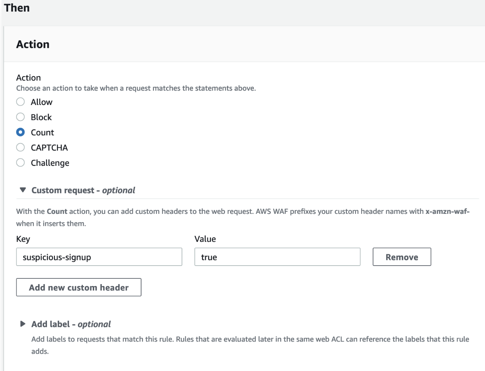

This configuration will send a header that reads X-Amzn-Waf-Suspicious-signup: true towards your application, so you can run additional checks at the application level. You can potentially create multiple similar rules, one per each unique header value you want to send, so for example if you want to send X-Amzn-Waf-suspicious-signup: volumetric on volumetric creation attempts, and X-Amzn-Waf-suspicious-signup: suspiciousBrowser, you can do it through matching different labels specifically rather than the whole ACFP namespace of labels.


## Monitoring
You've done a lot of hard work setting up and tuning protections for the upcoming sale but to make sure they're working as expected you need metrics and indicators you can check.

In this chapter, you will explore native built-in options for AWS WAF monitoring and visibility. Amazon CloudFront and CloudWatch provide metrics on actions and rule evaluations that can be useful to monitor and tune rules over time and particularly during an incident. You will also go over how to set up an alarm for detecting anomalous activity.

## Reviewing AWS WAF native built-in dashboards

AWS WAF provides traffic overview information for all requests evaluated but also specific metrics for Bot and Fraud control, when they are enabled. The metrics serve as a starting point to review and understand traffic trends and web ACL configuration performance.

1. Go to the AWS WAF console 
2. Select the workshop web ACL you've been working on.
3. Go to Traffic overview
4. Review the information under each of the different tabs:
* All traffic
* Bot Control
* Account takeover prevention
* Account creation and fraud prevention

### Creating Custom Dashboards

1. Go back to the AWS WAF service  All traffic widgets and repeat for the following:
* Top 10 rules
* Top 10 managed rules labels
* Captcha puzzles that were abandoned or not solved
2. Move to the Account takeover prevention tab and add the following widgets in the same way:
* Token status
* Suspicious credentials thresholds
* Session thresholds
3. Now move to the Account creation fraud prevention tab and also add the following widgets to the same dashboard:
* Registration page requests
* Overall risk scores
* Failed account creation response threshold breached

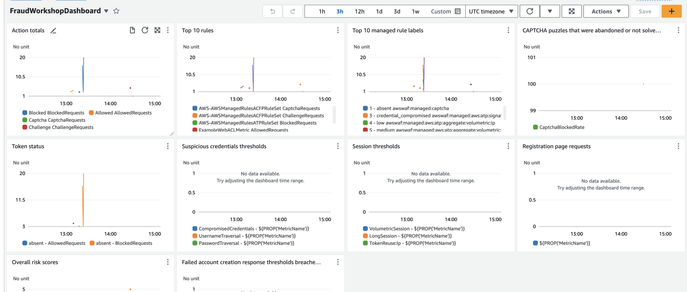

### Creating an alarm for important events
You can create an Amazon CloudWatch alarm that triggers an Amazon SNS message when the alarm changes state. An alarm watches a single metric over a time period that you specify, and performs one or more actions based on the value of the metric.

Alarms invoke actions for sustained state changes only, they are not triggered at first status change
You can set an alarm on a specific metric you have in count that you want to keep an eye on, for instance any flagged Compromised credentials, this will help with visibility on pattern changes to a specific URI or in your application traffic, so you can investigate further or tune your rules.

1. Go to alarms.
2. Select Create alarm.
3. Go to Select the metric and under ALL/WAFV2 select LabelName,Labelnamespace,WebACL.
4. Select the metric awswaf:managed:aws:atp:signal namespace and credential_compromised but only AllowedRequests. This will give you visibility when an unsual number of requests are hitting your login with a signal of compromised credential which might prompt a new rule or a change in rule action.
5. Fill the form as shown below. We will use an anomaly detection alarm, which will take some time to baseline activity before measuring variations.

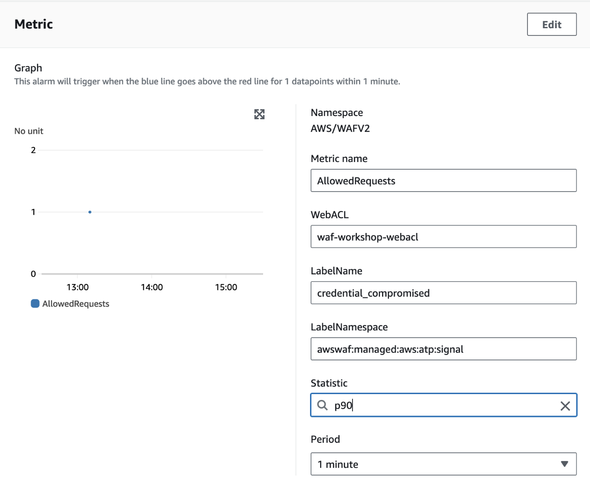

6. Click Next. Select In alarm and create a new SNS topic and add an email address(this will be deleted with the sandbox account deletion). Click Next again.
7. Add an Alarm name, such as ATPCompromisedCredentialsAlarm.
8. Review and click Create Alarm.

## Cost Optimizing your AWS WAF
Understanding AWS WAF costs
Let's first start by understanding the basics of AWS WAF pricing and how it affects the decisions you make for rules added.

AWS WAF pricing  consists of several pricing components:

Number of web ACLs and total number of rules (prorated hourly).
Numbers of millions of requests that passes through AWS WAF for inspection.
Partner-managed rules (Marketplace rules) each have their own pricing.
Intelligent Threat Mitigation (CAPTCHA, Challenges, Bot Control, and Account Takeover Prevention) evaluations.
These are some initial guidelines you can follow to start cost-optimizing your WebACL:

Block volumetric traffic with rules that have no additional costs (geo-blocking, rate limiting, IP block-listing, IP reputation)
Make use of Scope of inspection for paid rules (most specifically Bot Control, ATP and ACFP) in order to limit the number of requests evaluated.
Order your web ACL rules in a way that makes volumetric (and potentially cost-impactful) traffic hit rules with no extra costs, before hitting rules that have a cost(Free rules before paid rules).
Using Scope of inspection
AWS WAF Bot Control(ABC) is another intelligent threat mitigation option from AWS WAF, gives you visibility and control over common and pervasive bot traffic that can consume excess resources, skew metrics, cause downtime, or perform other undesired activities.

Your Bot Control, ATP and ACFP managed rule groups are important as a cost saving factor on its own, as they can reduce bot traffic hitting your application, causing you to process workloads that are unwanted. However, not all parts of your application are relevant for bots, and there is no need to inspect for bot traffic for all of the requests. In our example, we would like to exempt images from inspection by ATP.

Edit the AWS-AWSManagedRulesATPRuleSet managed rule in your web ACL Rules tab by clicking the box next to it, and clicking Edit.
On the Scope of inspection, but recommended for Bot Control to control costs section.
Click the box to Only inspect requests that match a scope-down statement.
The configuration layout should be familiar to you by now, as it uses the same method for scope-down as you already used when creating custom rules. For If a request, select the AND statement.
In Statement 1 click the box to Negate statement results, and it should match on URI Path, Ends with string, .png, Text transformation set to Lowercase.
In Statement 2 click the box to Negate statement results, and it should match on URI Path, Ends with string, .jpg, Text transformation set to Lowercase.
Click Save rule and Save. From now on requests to .jpg or .png files will not be inspected by ATP and you won't incur any ATP costs for them.

In your real-world scenario you might need to protect images against other bots, but still not care for other parts of the application, like .css, .js, or static .html files
Verifying the web ACL's rule order
Making good use of IP-based defenses should be a top-tier rule in your web ACL. Make sure that the IP Reputation and Anonymous IPs rule are at the top of the list.


When reordering rules, make sure that the rules that match on a specific label are after the rules that emit those labels. For example, a rule that looks for the compromised credentials label must be after the ATP managed rule.
Rule ordering and Scope of inspection statements are effective ways to optimize your AWS WAF costs. For applications where you are concerned with L7 DDoS attacks, a combination of AWS WAF with AWS Shield Advanced  is preferable, but this workshop does not cover it. Using automated processes that detect and block malicious IP addresses through an IP List match rule (such as in the Security Automations for AWS WAF  solution) is also a cost-effective way to block bad actors from abusing your paid components on AWS WAF.

## Advanced Cost Optimization
Using bot control before ATP or ACFP
AWS WAF Bot Control (ABC) can also help control costs by evaluating requests using the targeted bot control feature, before it hits the ATP or ACFP specialized rules, ABC can help by executing bot checks before the specialized fraud control checks happen. This is particularly useful for checking for the existence or reuse of the waf token or UBID.

Let's add Bot control- targeted bots and add it right before ATP.

On your web ACL Rules tab, add a new managed rule.
Select the AWS managed rule groups section.
Next to Bot Control, click the Add to web ACL button.
Click Edit.
For Bot Control inspection level we will use Targeted.
The Common inspection level for bot control only uses passive checks on incoming requests, and does not change or inject anything into the traffic to or from the client. It is configured by default to block any self-identifying bot, except for verified bots.

The default settings for all bot categories is to block them. Let's Override to Count, scroll down and click Save rule, scroll down all the way, and click Add rules.
On the Set rule priority page, click to select the AWS-AWSManagedRulesBotControlRuleSet rule, and click the Move up button until the rule is just above the ATP rule but after the AWS-AWSManagedRulesBotControlRuleSet rule.
Click Save.
Using advanced rate-based rules before ATP and ACFP
We set Targeted bots with an override to count, so we can use the labels provided to create rate rules or other custom rules that will look for a combination of behavior before moving on to ATP/ACFP.

A good way to test volumetric activity is to combine a rate-based rule with a challenge action, or a CAPTCHA action, this will create a soft hurdle for a suspicious requester to overcome before completing a request, without getting blocked immediately. We will be using the token-reuse and volumetric session signals to create a custom rate rule.


Although Challenge/CAPTCHA actions have an additional cost, it can still be more cost-efficient than paid rules evaluation, depending on the use case.
Let's create a rule that combines the two options above, if we modify our logic to rate limit requests based on their token.

Click Add rules again, choose Add my own rules and rule groups.
For the rule name, type TokenRateLimit
For Type, choose Rate-based rule.
For Rate limit use 100.
For Request aggregation choose custom keys.
For Request aggregation key Select Label namespace and add awswaf:managed:aws:bot-control:targeted:aggregate:volumetric:session:token_reuse:
Click Add a request aggregation key, Select Label namespace and add awswaf:managed:aws:bot-control:targeted:aggregate:volumetric:session:high:
For the Scope of inspection and rate limiting select Consider all requests
(OPTIONAL)Scroll down to the rule Action, and swap it from Block to Challenge. Keep the immunity time at 300, so that AWS WAF keeps on challenging flooders even if they have previously solved a challenge. You can even set up a second Rate Limit rule, set at a higher number, configured just to Block, if that makes sense in your real-world scenario.
Click Add rule, then Save. Make sure the rule goes after the Managed Bot Control ruleset but before ATP.
To test this rule you can run the same script we used for ATP but check the logs for the rate rule as the terminating rule.

Script to test the rule(remember to update the website URL)

### Run these scripts to test

```bash
URL="https://<<d1234567890.cloudfront.net>>/login-submit.html"
for i in $(seq 1 20); do curl --http1.1 -X POST -H "Content-Type: application/x-www-form-urlencoded" -d 'username=WAF_TEST_CREDENTIAL@wafexample.com&password=WAF_TEST_CREDENTIAL_PASSWORD' -w "Status code: %{response_code}\n" ${URL} -s -o /dev/null; done
```

### To check the logs you can re-run this query

```
fields @timestamp, httpRequest.clientIp, action, terminatingRuleId
| parse @message '"labels":[*]' as Labels
| filter httpRequest.uri = "/login-submit.html"
| sort @timestamp desc
```

# Helpful Links
[Analyzing AWS WAF Logs in Amazon CloudWatch Logs](https://aws.amazon.com/blogs/mt/analyzing-aws-waf-logs-in-amazon-cloudwatch-logs/)
[Visualize AWS WAF logs with an Amazon CloudWatch dashboard](https://aws.amazon.com/blogs/security/visualize-aws-waf-logs-with-an-amazon-cloudwatch-dashboard/) 
[Deploy a dashboard for AWS WAF with minimal effort](https://aws.amazon.com/blogs/security/deploy-dashboard-for-aws-waf-minimal-effort/)
[Security Automations for AWS WAF](https://aws.amazon.com/solutions/implementations/security-automations-for-aws-waf/)
[The three most important AWS WAF rate-based rules](https://aws.amazon.com/blogs/security/three-most-important-aws-waf-rate-based-rules/)
[Cost-effective ways of securing your web application using AWS WAF](https://aws.amazon.com/blogs/networking-and-content-delivery/cost-effective-ways-for-securing-your-web-applications-using-aws-waf/) 
