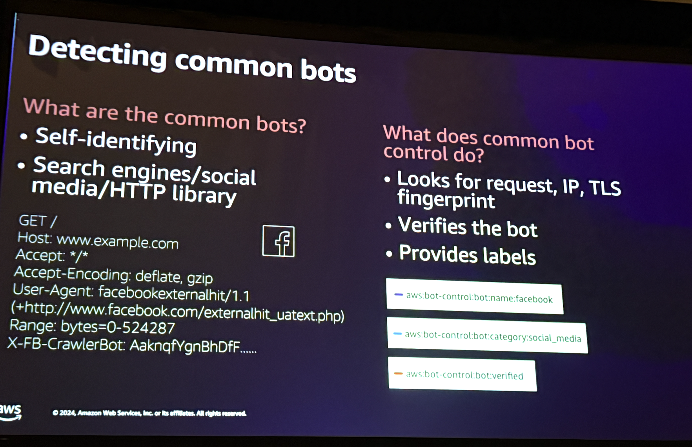
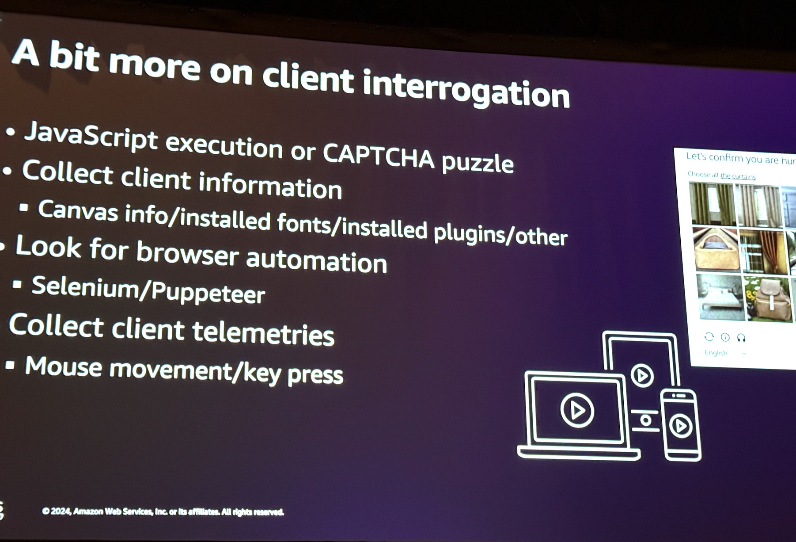
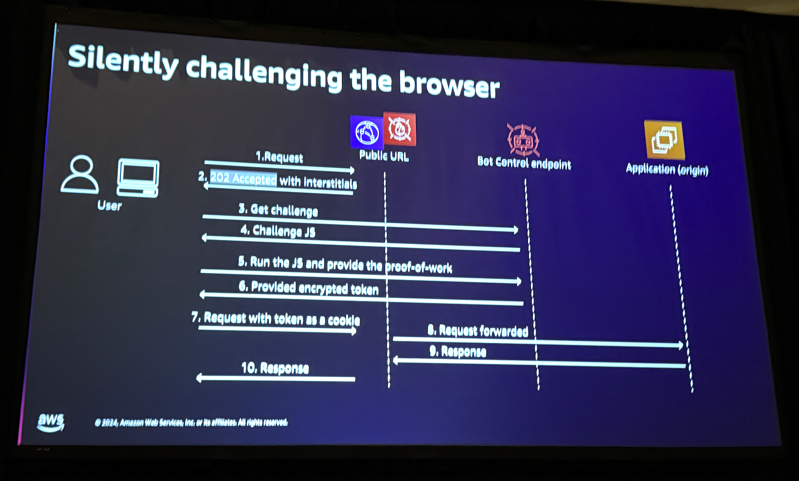
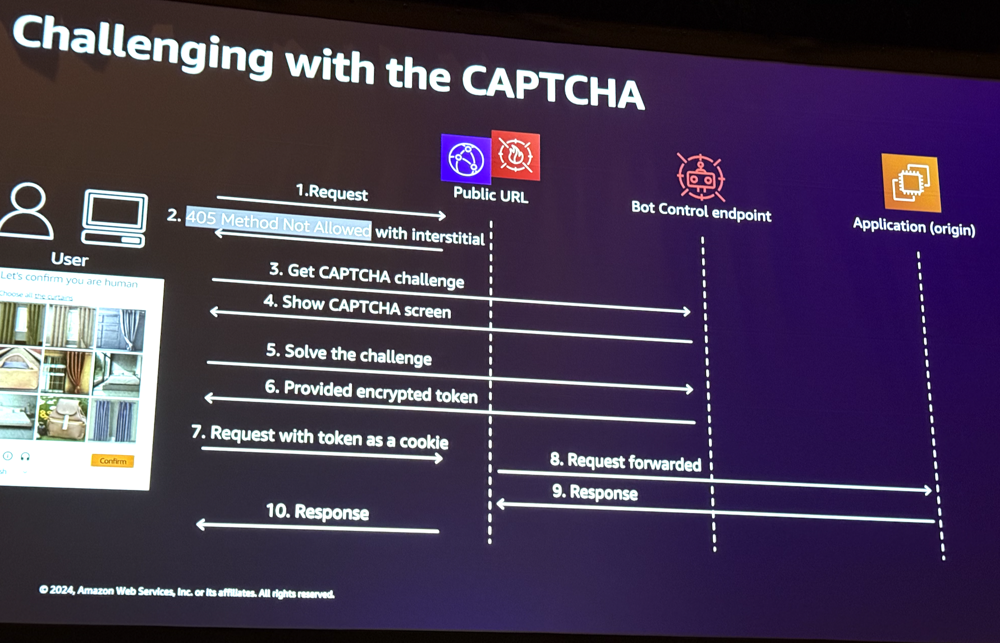
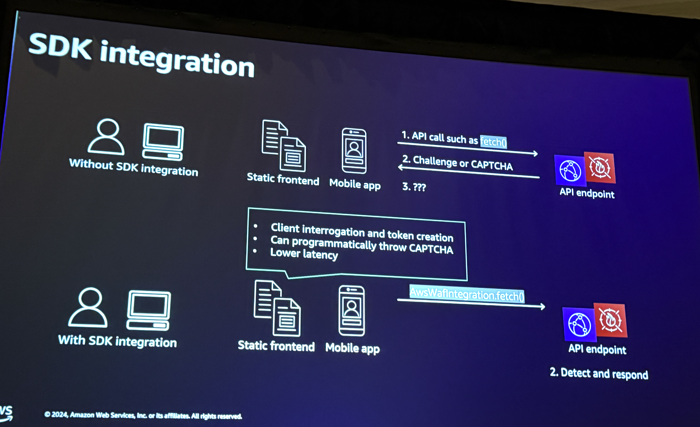
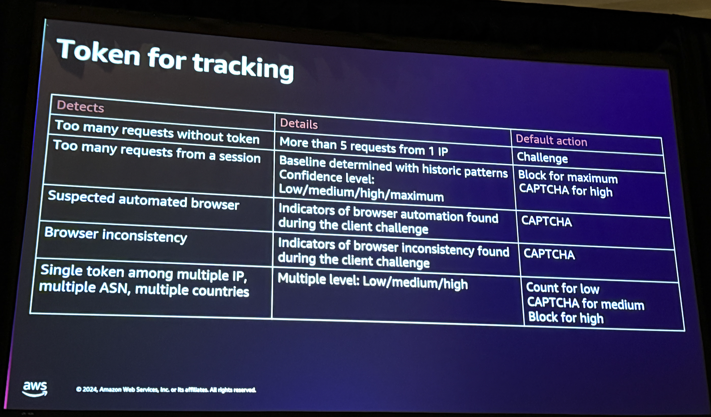

In the ever-evolving threat landscape, web applications face constant attacks from bot traffic and fraudulent activities. These threats can lead to devastating consequences, including data breaches, financial losses, and reputational damage. Explore AWS WAF, including its features for bot control, account takeover prevention, and account creation fraud prevention. This chalk talk offers you the opportunity to actively participate and learn from real-world use cases, exploring how these features can be effectively employed to detect and mitigate bot traffic, credential stuffing, web scraping, and other fraudulent activities.
Joanna Knox, Senior Cloud Support Engineer, Amazon

Julian Ju(yoonhong), Edge services GTM SA, Amazon Web Services

Mon, December 2
2:30 PM - 3:30 PM PST
MGM Grand | Level 1 | Boulevard 167
Session types: Chalk talk
Topic: Security, Compliance & Identity, Content Delivery
Industry : Cross-Industry Solutions
Area of interest: Application Security, Network & Infrastructure Security, Threat Detection & Incident Response
Level: 300 – Advanced
Role: Cloud Security Specialist, Developer / Engineer, Solution / Systems Architect
Services: Amazon CloudFront, AWS WAF

# Notes
Agenda
What is a bot?
AWS WAF Overview
Foundational Rules
AWS WAF Bot control and fraud control
customer examples

## What is a bot?
Good bots identify themselves, and malicious bots hide themselves as users/browsers.
Bad bots - DDOS, account/credit card fraud, scraping, etc..

## AWS WAF Overview
Protects over common HTTPS attacks. You can integrate with api gateway, app sync, cognito, etc..

Web ACL operates with rules and rule groups and inspection criteria. Rules are processed from lowest priority to highest until it matches a rule with a terminating action

Terminating Actions - Allow/Block
Non terminating actions - Count
Either - CAPTCHA/Challenge
Can also add headers or labels for further rule evaluation or downstream servers with headers.

WAF Logs and WAF dashboards are good, use amazon data firehose, cloudwatch, or S3 to store.

## Foundational Rules
Increases costs of bot operators to operate their botnets.

* Rate-based rules: Block L7 DDoS attacks once a rate threshold is reached.
* Layering rate-based rules: Allows you to apply different rate-based rules to different parts of your application. Example is to protect a specific API endpoint vs the global website with caching.
* Anti-DDOS Rate-Based Rule: Header(host) + URI + IP, evaluation window 60, limit 10, block.
* IP Based controls: Blocking with known malicious, regional, specific IP's, or Amazon's IP Reputation List.
* Challenge rule action: Javascript challenge, AWS WAF Token.

## AWS WAF Bot Control and Fraud Control
For bots that evolve and evade defenses.

* Bot Control - Managed AWS WAF Rule. Identifies, labels, and manages both friendly and malicious bots. 2 levels of protection, common (for self identifying bots), targeted (for evasive bots)
* Fraud Prevention - Detects and prevents fraud attempts, account takeover prevention, fake account creation prevention

### Evasive bots

* Challenges: Use existing browser header and values, not using well-known bot IP addresses, mimics the real browser such as javascript execution

* Responses: client interrogation, uniquely identify the client session, monitor the activity

## Fraud Prevention

* Account takeover prevention:
    * Analyzes POST request to the login url
    * Detects compromised credentials
    * login and password traversal
    * tracks response too (when used with cloud front)

* Account Creation Fraud Prevetion
    * Analyzes human interaction in the registration page and POST request
        * SDK integration is mandatory for human interaction detection
    * detects phone number and address abuse

    How does ACFP handle auto-fills from web browsers or java script based extensions from password storage tools like dashlane.
    

## Dev Guide
[ACFP Developer Guide](https://docs.aws.amazon.com/waf/latest/developerguide/waf-acfp.html)

## Contacts
linkedin julianju
linkedin joanna-knox-3161a34
