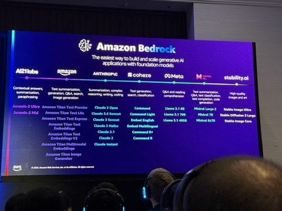

Navigating through complex cloud solutions can be a daunting task. In this session, see how generative AI can help solve this problem by building an AWS solutions architect agentic app. Using Amazon Bedrock, learn how to build an app that can query AWS documentation, deploy infrastructure, create diagrams, and more. The session ends with a live demo, where the generative AI app handles a variety of tasks, significantly reducing manual effort and error. Gain practical insights and the know-how to build generative AI agentic apps to alleviate similar pain points.

Namrata Shah, Managing Director, Nuveen

Banjo Obayomi, Senior Developer Advocate, AWS

Mon, December 2
11:30 AM - 12:30 PM PST
Mandalay Bay | Level 2 South | Mandalay Bay Ballroom L | Content Hub | Turquoise Screen
Session types: Breakout session
Content format: Silent session
Topic: AI/ML
Area of interest: Generative AI
Level: 300 – Advanced
Role: Developer / Engineer, Solution / Systems Architect
Services: Amazon Bedrock, Amazon Q

# Notes
Check out Namrata Shah youtube channel for more information about agentic workflows.

## Builder Tools
You can buy or use foundational models as a part of the workflow
### Applications to boost productivity
Amazon Q
Amazon Q Developer (Similar to claude or github co-pilot)
### Models and tools to build generative AI apps
Amazon Bedrock
### Infra to build and train models
Amazon Sagemaker
AWS Trainium and Inferentia
GPU based EC2's

## Amazon Bedrock Partner Models

## Agentic Workflows
An AI agent is an autonomous system that percieves, decides, and acts to achieve goals, adapting its behaviour based on experiencesw and interactions.

Agentic is a spectrum
Rule based, ML models, adaptive AI, ??? , fully autonomous agent.

### Patterns
* Reflection: Self-examination
* Tool use: Leveraging external functions for information and data processing
* Planning: Devising and executing multi-step plans for complex goals
* Multi-agent collaboration: Multiple AI agents working togehter for enhanced problem-solving

### Why build agentic systems?
* Enhanced Problem-solving: Bread down complex tasks, adapt strategies
* Increased autonomy: minimal supervision, handles diverse actions
* Improved efficincies: Automate multi-step processes, reduce repeat tasks
* Scalability: Manage increaseing complexity extend capabiltities in a modular structure

### Lets Build
Visit Namrata Youtube for specific step by steps

AWS Solutions Architect Agentic App
* Query AWS Documentation: Offer instant, context-aware responses to queries
* Deploy infrastructure: Automate cloud setup and configuration
* Create diagrams: Visualize complex architectures effortlessly

### Live Coding
Broken up into action groups from the bedrock console. It will call different tools or lambda functions to do things

Attach knowledge bases for RAG based models

Agentic workflows do planning, rationale, knowledge base lookup, knowledge base lookup output, final response formatting with markdown. Essentially bedrock will show you how the agent is operating, where it is getting its data from, etc..

*** Look for code afterwards for examples of coding the lambda functions with python ***

The agentic workflow will call additional functions it has available to it in order to call a function to describe the diagram it just created in order to provide additional context.

The agent will then also curate a python CDK script to deploy the application architecture it just created and diagramed.

*** You can additionally look at the backend via a bash stream script to see things as they happen in the background ***

Can also have the agentic workflow create a lambda function via a (create lambda function, lambda function). It will actually write the lambda code and then deploy the function. It can then also give you python client side code to call the lambda function. 

[Agentic Workflows](https://catalog.workshops.aws/building-agentic-workflows/en-US)