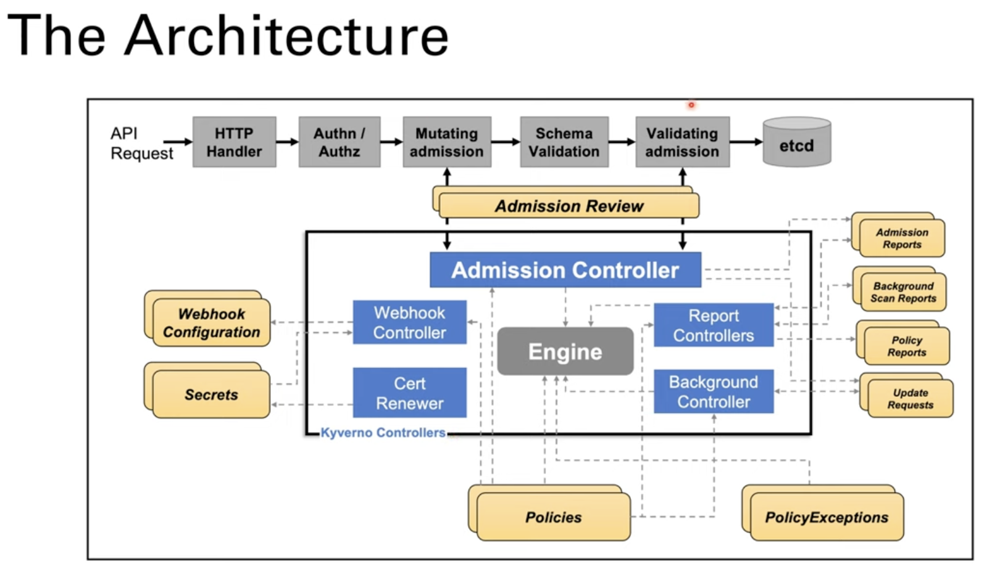
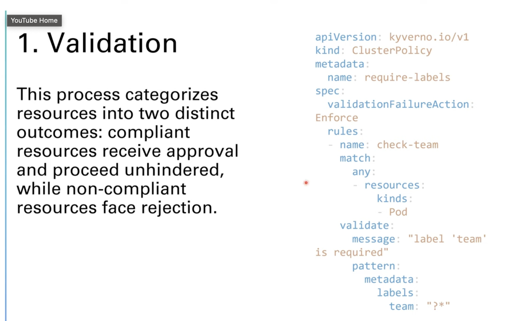
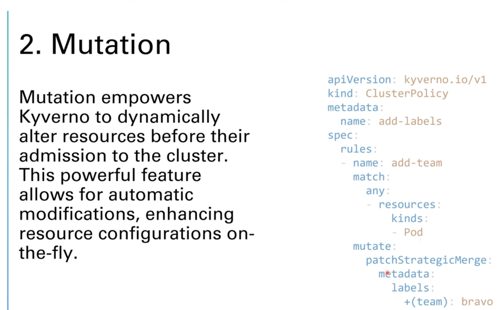
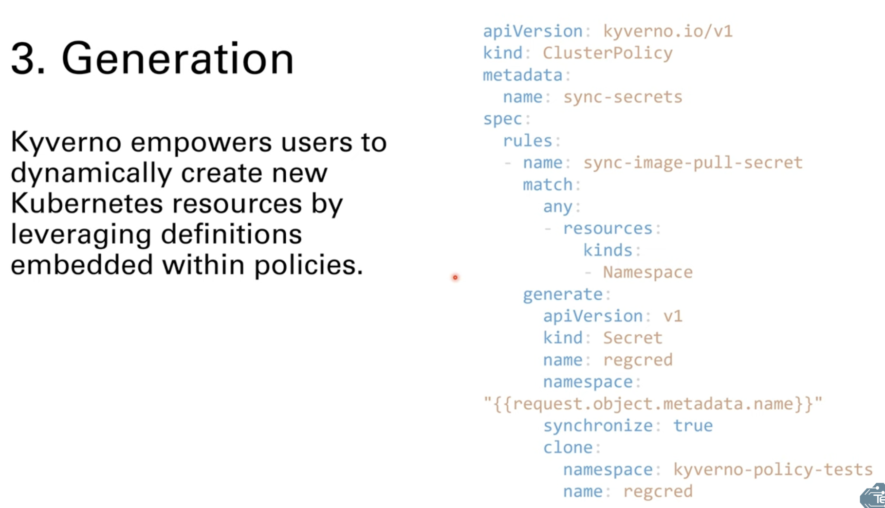

OPN306-R | Enhancing Kubernetes security with policy as code using Kyverno [REPEAT]

Delve into advanced security for Amazon EKS by leveraging policy as code with Kyverno. This chalk talk explores best practices for defining, managing, and enforcing security policies across your Kubernetes clusters. Learn how to automate compliance checks, mitigate vulnerabilities, and maintain consistent security postures. Through hands-on demonstrations, gain practical insights into integrating Kyverno with Amazon EKS, enabling dynamic policy management and enhancing overall cluster security. Perfect for security and platform engineers and DevOps professionals looking to bolster their Kubernetes security strategy.
Marina Novikova, Sr Partner Solution Architect, AWS

Mon, December 2
8:30 AM - 9:30 AM PST
MGM Grand | Level 3 | 305
Session types: Chalk talk
Topic: Kubernetes, Security, Compliance & Identity
Area of interest: Application Security, Open Source
Level: 300 – Advanced
Role: Cloud Security Specialist, DevOps Engineer
Services: Amazon Elastic Kubernetes Service (Amazon EKS)

# Start
## What is Kyverno
* A policy engine for kubernetes, policies as kubernetes  resources. No new languages needed.
* Resource management: validate, mutate, generate, or cleanup resources.
* Security: Verify container images and inspect metadata
* Resource matching: use label selectors and wildcards
* overlays for validation and mutation(like kustomize)
* config syncronization across namespaces
* admission controls block non-conformant resources.
* policy violations reporting: report instead of blocking
* use kyverno CLI in CI/CD pipelines



## Validation
This process categorized resources into two distinct outcomes: compliant resources receive approval and proceed unhindered, while non-compliant resources face rejection.


## Mutation
Mutation empowers kyverno to dynamically alter resources before their admission to the cluster. This powerful feature allows for automatic modifications, enhancing resource configurations on the fly. 


## Generation
Kyverno empowers users to dynamically create new kubernetes resources by leveraging definitions embedded within policies


## Kyverno Installation
[Kyverno Installation](https://kyverno.io/docs/installation/)

Helm is the preferred installation method
### Standalone Installation Method
``` bash
helm repo add kyverno https://kyverno.github.io/kyverno/
helm repo update
helm install kyverno kyverno/kyverno -n kyverno --create-namespace
```

### High Availability Installation
``` bash
helm install kyverno kyverno/kyverno -n kyverno --create-namespace \
--set admissionController.replicas=3 \
--set backgroundController.replicas=2 \
--set cleanupController.replicas=2 \
--set reportsController.replicas=2
```

### Pod Standard Security Policies

``` bash
helm install kyverno-policies kyverno/kyverno-policies -n kyverno
```