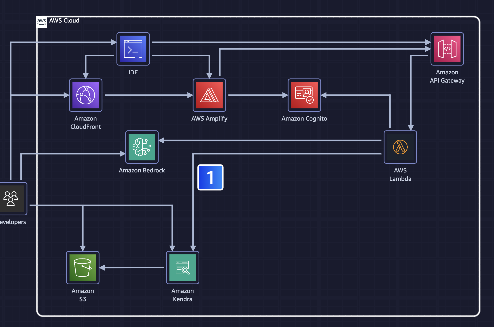

In this new interactive training session powered by generative AI, address a simulated business scenario and build an AI chatbot that taps into a knowledge base to provide customers with detailed, contextual information. Leverage AWS services like Amazon Bedrock and Amazon Kendra to index data and enable Retrieval Augmented Generation (RAG). Integrate Amazon serverless services for efficient application code execution. A laptop is required for this session.
Jimmy Silva, Sr Technical Training, AWS

Thu, December 5
1:00 PM - 2:30 PM PST
Mandalay Bay | Level 2 South | Mandalay Bay Ballroom A
Session types: Interactive training
Topic: AI/ML
Industry : Cross-Industry Solutions
Area of interest: Application Integration, Generative AI
Level: 200 – Intermediate
Role: Data Scientist, Developer / Engineer
Services: Amazon API Gateway, Amazon Bedrock, Amazon Kendra

# Notes

## Amazon Kendra
The purpose of using Amazon Kendra in this solution is to index documents stored in an Amazon S3 bucket and make their content searchable and retrievable through a search interface. Amazon Kendra is used to provide relevant and accurate search results from the enterprise documents, enabling the chatbot application to tap into the city's unique knowledge base and provide contextually accurate information to user queries.
References
https://docs.aws.amazon.com/kendra/latest/dg/what-is-kendra.html
https://docs.aws.amazon.com/whitepapers/latest/aws-overview/machine-learning.html

1. Using the AWS Management Console, developers create an Amazon Kendra index. With the index, users can search and retrieve information from documents stored in an S3 bucket on Amazon Simple Storage Service (Amazon S3).

2. Amazon Kendra is an intelligent search service that uses machine learning to provide relevant and accurate search results from a variety of data sources, including S3 buckets that contain enterprise documents, databases, and other content repositories.

3. Developers upload documents to the S3 bucket and then configure that S3 bucket as a data source so that Amazon Kendra can automatically index the documents during the sync process, and then make their content searchable and retrievable through the search interface.

4. Using an integrated development environment (IDE) such as Amazon SageMaker Code Editor, developers can configure Amazon API Gateway and AWS Lambda functions to create and deploy a serverless application.

5. Amazon API Gateway is a fully managed service that helps developers create, publish, maintain, monitor, and secure APIs at any scale.

6. The Lambda functions use the Amazon Kendra index and LangChain libraries for Retrieval Augmented Generation (RAG) and prompt engineering, using Amazon Bedrock models to power the serverless application.

7. After deploying the serverless application, developers use the backend services to configure and deploy a frontend user interface (UI). Specifically, they use AWS Amplify, Amazon CloudFront, and Amazon S3.

8. AWS Amplify is used to develop and deploy cloud-powered fullstack applications without hassle. Amazon CloudFront is a content delivery network (CDN) service built for high performance, security, and developer convenience.

9. Developers create an Amazon Cognito user to authenticate and access the frontend UI, which is configured and deployed through a Lambda function.

10. Using the Amazon Bedrock console, developers can enable access to the AI models. Amazon Bedrock is a fully managed service that offers a choice of high-performing foundation models (FMs) along with a broad set of capabilities to build generative AI applications.

11. After authentication is successful through Amazon Cognito, the user can chat with the serverless application and ask questions related to the documents that were uploaded to the S3 bucket. 

12. The frontend UI seamlessly integrates with LangChain's powerful capabilities, invoking RAG and prompt engineering functionalities. Combined with the versatility of large language models (LLMs), such as Mistral AI, the solution delivers highly relevant, contextual, and engaging responses to users.

13. Developers update and deploy Lambda function code to experiment with prompt engineering on Amazon Titan.

## Practice Lab Goals

* Index documents for efficient searching and retrieval using Amazon Kendra and retrieve relevant context using the API.
* Host a chatbot application by using AWS Amplify and Amazon CloudFront.
* Invoke AWS Lambda functions for RAG and prompt engineering through Amazon API Gateway.
* Invoke Amazon Bedrock FMs by using the Amazon Kendra API-returned content and a prebuilt prompt.

## Lab

### Kendra
1. In the top navigation bar search box, type: kendra
2. In the search results, under Services, click Amazon Kendra.
3. Go to the next step.
4. In the Indexes section, click Create an index.
5. Go to the next step.
6. In the Specify index details step, for Index name, type: kendra-index
7. For IAM role, on the dropdown list, choose kendra-index-role.
8. Scroll down to the bottom of the page, and then click Next (not shown).
9. Go to the next step.
10. In the Add additional capacity step, for Editions, choose Developer edition.
11.  In the Configure user access control step, for "Use tokens for access control?", choose No.
12. For User-group expansion, choose None.
13. Scroll down to the bottom of the page, and then click Next (not shown). 
14. At the bottom of the page, click Create.
15. The index can take 5 to 30 minutes to be created.
16. Once you get the green box that your index has been created
17. Click Add data source.
18. Under data sources were going to add an S3 bucket, next to S3 bucket do "add connector"
19. data source name "kendra-data-source"
20. Default language "English (EN)"
21. Select the kendra-docs-role in IAM role.
22. Configure VPC and security group. (choose no VPC)
23. Configure Sync settings: Enter data source location "browse s3"
24. Keep 50MB, Sync Mode Full Sync, Sync Schedule "Run on demand"
25. Review the S3 field mapping default data source fields(no changes). Select Add data sources.
26. Navigate to Amazon Sagemaker and admin configuration domains, select "code-editor-xxxxxx". Select the studio, then select the user profile and do "open studio". Skip tour for sagemaker studio
27. Run the code editor application. Once its done starting select "open"
28. Open the folder /home/sagemaker-user/
29. Do vs code trust the author
30. select hamburger menu, select terminal -> new terminal
31. Review the code and do unzip serverless-chatbot-code.zip
32. Find the startup.sh script and open the file, review.
33. CD into serverless-chatbot-code and run ./startup.sh
34. Review samconfig.toml
35. While the startup script is runnig it will prompt you to select a deployment, select Amazon CloudFront and S3 deployment.
36. Press Enter for your S3 bucket name. It will then issue an Amplify Publish command to publish to dev.
37. You can then use sagemaker to open up the external cloudfront website.
38. It will prompt you to sign into your website.
39. Navigate to cognito and click on the chatbot user pool.
40. Go to lambda, select functions, run "sam-bedrock-stack-cognitousercreatefunction"
41. Scroll down to test and enter the event name test and click invoke
42. You shouold see it run with "secret updated successfully!"
43. You should then see your bedrock user created
44. In secrets manager you should see the ui-credentials to be able to log into your cloudfront website.
45. Navigate to bedrock and select "enable specific models"
46. Select "Titan Text G1 - Premier" and next and submit.
47. You should be able to then run the RAG model.
48. You can upload new docs to S3 and go back to kendra S3 data source then run "sync now" again for it to index the new role.

